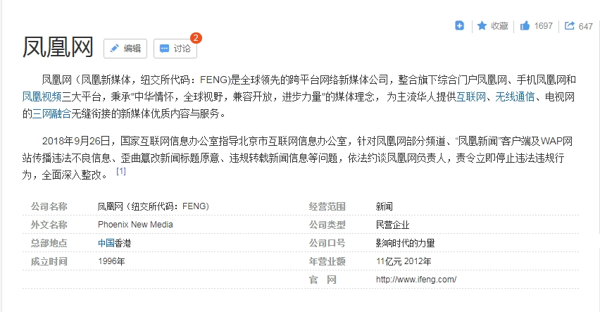
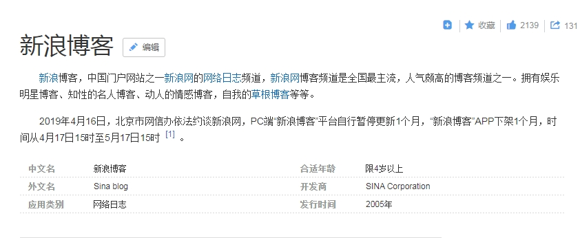

# IT公司和产品的编年体

## 1991年
#### 1. 瑞星杀毒

## 1996年
#### 1. 凤凰网

#### 2. 江民杀毒

## 1997年
#### 1. 网易

## 1998年

#### 1. 新浪网

#### 2.  

## 1999年
#### 1. 阿里巴巴

#### 2.金山毒霸

## 2000年

#### 1. 蜂鸟网

#### 2. 百度
 

## 2001年
### 1. 
### 2. 

## 2002年

#### 1. QQ邮箱

#### 2. 博客网

#### 3. 中国博客网

## 2003年
#### 1. 网易邮箱

## 2004年
#### 1. FaceBook

#### 2. 博客大巴

#### 3. 博客园

## 2005年
#### 1. QQ空间

#### 2. 豆瓣网

#### 3. 奇虎360

#### 4. 人人网

#### 5.搜狐博客

#### 6.新浪博客

#### 7.抓虾网

## 2006年

#### 1.Twitter

#### 2.百度空间

#### 3.牛博网
 

#### 4. 鲜果网

#### 5. 中国同学网

## 2007年
### 1. 饭否网

## 2008年

### 1. 新浪邮箱

## 2009年
#### 1. 嘀咕网

#### 2. 朋友网

#### 3. 新浪微博

## 2010年
#### 1. 可牛杀毒

#### 2. 米聊

#### 3.人民微博

#### 4.搜狐微博

#### 5.腾讯微博

#### 6.网易微博

## 2011年
#### 1. Lofter

#### 2. TalkBox

#### 3. 微信

#### 4.新华微博

## 2012年

## 2013年